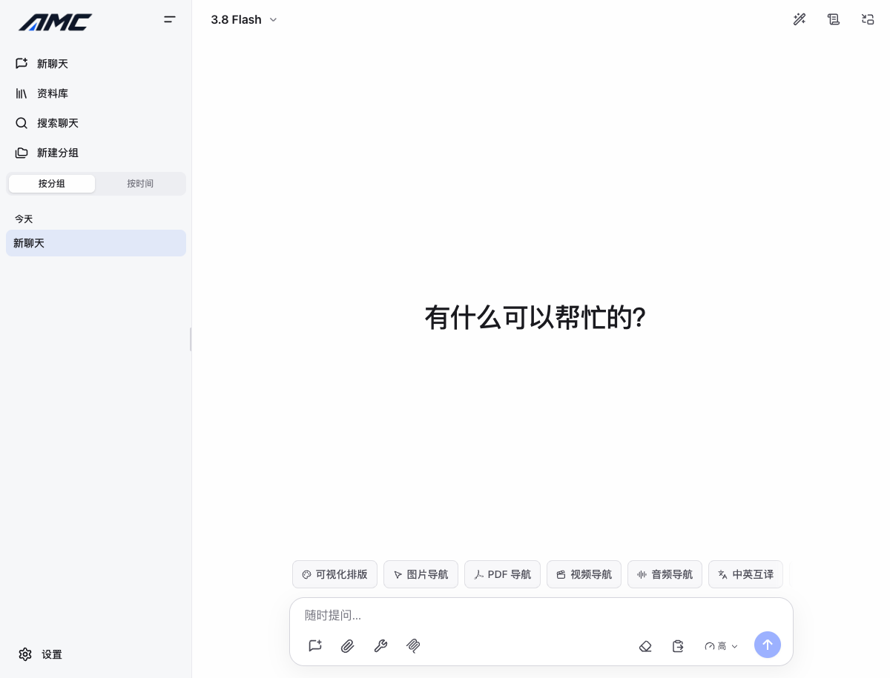

import { Card, CardGrid, LinkCard } from '@astrojs/starlight/components';

## 核心架构与特性

<CardGrid stagger>
  <Card title="深度思维链 (Thinking)" icon="open-book">
    支持 Gemini 3.x 系列深度思维链可视化、Token 预算精细控制与思维链实时双向翻译。 [查看思考模式配置与翻译指南
    →](/models/thinking/)
  </Card>
  <Card title="实时音视频 (Live API)" icon="laptop">
    双向低延迟语音通话、摄像头画面捕获、屏幕共享与基于 AudioWorklet 的实时音频波形渲染。 [探索实时双向音视频通话
    →](/models/live-api/)
  </Card>
  <Card title="交互式构件 (Live Artifacts)" icon="puzzle">
    代码块自动识别为全屏 HTML/SVG 交互沙箱，内置 Apache ECharts、Mermaid 与 Graphviz 多引擎图表直出。
    [体验图表沙箱与可视化渲染 →](/tools/live-artifacts/)
  </Card>
  <Card title="本地 Python 沙箱 (Pyodide)" icon="setting">
    浏览器端 WASM 独立安全环境执行科学计算，预装 numpy/pandas，动态安装 scipy/sklearn，本地图表自动捕获。
    [了解零服务器算力本地 Python →](/tools/code-and-sandbox/)
  </Card>
  <Card title="扩展协议支持 (MCP)" icon="add-document">
    完整支持 Model Context Protocol，兼容本地 stdio 进程与远程 SSE/Stream 服务，提供严谨的工具调用审批流。
    [接入本地与远程 MCP 服务 →](/tools/mcp/)
  </Card>
  <Card title="数据与隐私安全 (Local-First)" icon="bars">
    数据默认存储于浏览器 IndexedDB 并由 Web Locks 保护；Gemini 原生与 OpenAI 兼容配置严格隔离。 [深入 Local-First
    架构与安全模型 →](/deployment/architecture/)
  </Card>
</CardGrid>

---

## 场景与指引

根据您的使用场景与身份，快速找到最相关的指引与最佳实践：

### 新手起步

<CardGrid>
  <LinkCard
    title="快速启动 (Quickstart)"
    description="3 步快速配置，选择最适合您的浏览器在线体验或本地运行方式。"
    href="/getting-started/quickstart/"
  />
  <LinkCard
    title="服务商与 API 配置"
    description="BYOK 模式深度解析，学习如何安全配置 Gemini 原生与 OpenAI 兼容双通道。"
    href="/getting-started/api-configuration/"
  />
  <LinkCard
    title="PWA 桌面与多端体验"
    description="免下载安装包，直接将控制台作为轻量无边框独立桌面 App 安装到系统。"
    href="/getting-started/pwa/"
  />
  <LinkCard
    title="内置模型矩阵速查"
    description="Gemini 3.x 及具身智能模型特性对照、上下文窗口尺寸与最佳适用场景选型。"
    href="/models/model-matrix/"
  />
</CardGrid>

### 进阶功能

<CardGrid>
  <LinkCard
    title="联网检索与地图引用 (Search & Maps)"
    description="独家实名引用与地图交互卡片，消除幻觉并直观呈现地理与商户信息。"
    href="/tools/web-search-maps/"
  />
  <LinkCard
    title="高级文件处理与多模态"
    description="PDF 页面即时跳转、高清图像坐标定位、视频精确定位与音频压缩传输。"
    href="/tools/files-multimodal/"
  />
  <LinkCard
    title="斜杠命令速查 (Slash Commands)"
    description="掌握 /model、/fast、/retry 等 17 种高效快捷输入指令与实时过滤技巧。"
    href="/power-user/slash-commands/"
  />
  <LinkCard
    title="全局快捷键与交互手势"
    description="命令面板、Tab 轮巡模型、划词提问与画中画 (PiP) 无缝键盘流控制。"
    href="/power-user/shortcuts/"
  />
</CardGrid>

### 部署与运维

<CardGrid>
  <LinkCard
    title="Docker Compose 双容器部署"
    description="前端 Web + 独立 Node API 极简编排，支持本地私有代理与无外网内网部署。"
    href="/deployment/docker/"
  />
  <LinkCard
    title="静态托管 + 独立 API"
    description="Cloudflare Pages / Vercel 静态分发配合后端 Token 代理的安全架构。"
    href="/deployment/static-and-api/"
  />
  <LinkCard
    title="环境变量与安全边界"
    description="生产级安全配置清单，防范 API 密钥泄露与跨域滥用。"
    href="/deployment/environment-variables/"
  />
  <LinkCard
    title="缓存维护与数据迁移"
    description="IndexedDB 存储配额监控、数据一键 JSON 导出与跨设备迁移指南。"
    href="/faq/storage-and-reset/"
  />
</CardGrid>
